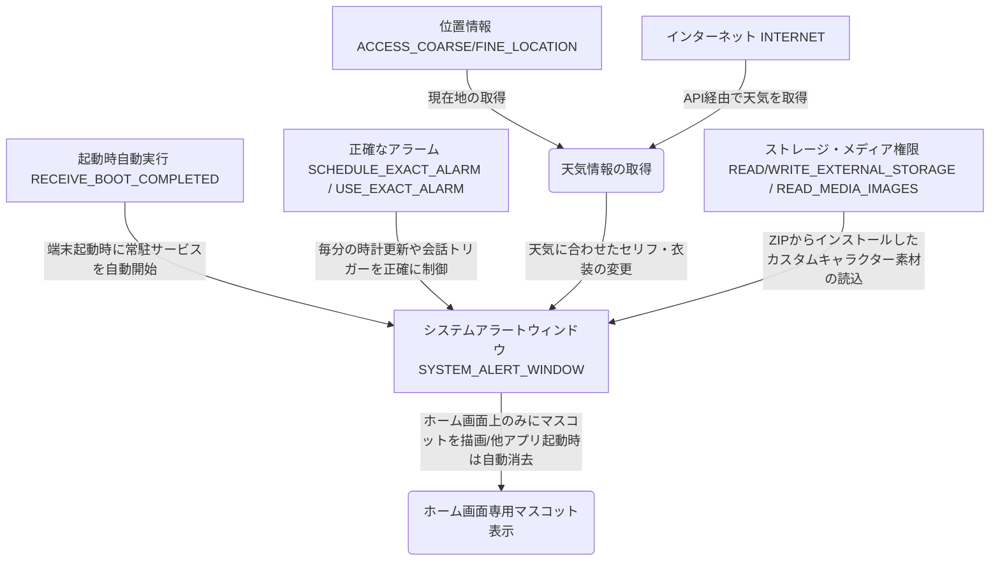

# システムアラートウィンドウ（他のアプリの上に重ねて表示）権限の利用申請・正当化説明書

本書は、デスクトップマスコットアプリ『HomeMascot』において、従来のホーム画面ウィジェットから「システムアラートウィンドウ（`SYSTEM_ALERT_WINDOW`）」を用いた画面常駐マスコット方式へ移行するにあたり、その必要性、正当性、およびアプリが要求する他の全権限との連携ストーリーを Google Play 審査やユーザー説明向けに定義したものです。

---

## 1. 申請する権限について
* **対象権限**: `android.permission.SYSTEM_ALERT_WINDOW` (他のアプリの上に重ねて表示)
* **アプリにおける機能名**: ホーム画面専用・デスクトップマスコット表示機能

> [!IMPORTANT]
> **本アプリにおける表示ポリシー**
> 本アプリのオーバーレイ表示は**「ホーム画面（ランチャー画面）上」のみ**に制限されています。
> ユーザーがホーム画面から他のアプリ（ブラウザ、設定、SNS、ゲームなど）へ遷移したことを検知した場合、オーバーレイマスコットは**自動的に非表示（消去）**になり、他のアプリの操作を妨げたり、表示を遮ったりすることはありません。再度ホーム画面に戻った際にのみ、自動的にマスコットが再表示されます。

---

## 2. 権限が必要な理由と正当化 (Justification)

### 従来の「ホーム画面ウィジェット」の技術的制約
1. **リアルタイムな対話・更新のOS制限**:
   Androidの標準ウィジェット（AppWidget）は、バッテリー節約とシステム負荷軽減のため、OS側で更新頻度が最大30分間隔等に制限されています。時計の毎分更新や、ユーザーがタップした際のインタラクティブなアニメーション、即座の表情・セリフ変化を滑らかに表現することが技術的に不可能です。
2. **操作インタラクションの制限**:
   ウィジェット領域内では、ドラッグして位置を画面上の好きな場所に動かすような動的なジェスチャー操作を行うことができません。
3. **境界の制限**:
   ウィジェットはホーム画面の定められたグリッド内に固定されるため、画面上を自由に歩き回ったり、角にひょっこり現れたりする「デスクトップマスコット」としての本来の動的なレイアウトが表現できません。

### 「システムアラートウィンドウ」による解決と提供するユーザー体験
* **ホーム画面上でのみ動作する、生き生きとしたデスクトップマスコット**:
   システムアラートウィンドウを使用することで、ホーム画面上でキャラクターを自由なレイアウトで重ねて描画できます。ウィジェットの制限に縛られないため、タップされた際のリアクション、時間経過に応じた表情変化、セリフの滑らかな吹き出し表示、ドラッグ＆ドロップによる自由な配置変更を、非常に高い応答性で実現します。
* **他アプリ起動時の自動閉止（非表示）によるユーザビリティの確保**:
   他のアプリがフォアグラウンドになった際は、オーバーレイ表示を即座に自動シャットダウン（クローズ）します。これにより、「他のアプリの邪魔になる」「ゲームの操作中に誤タップしてしまう」「プライバシー情報が重ねて表示される」といったシステムアラートウィンドウ特有のデメリットを完全に排除しつつ、ホーム画面にいる時だけ癒やしや情報（天気、バッテリー、メモ）を提供します。

---

## 3. アプリの全権限とマスコット動作の連携ストーリー

本アプリが要求する全ての権限は、ホーム画面上に重ねて表示されるマスコットが、ユーザーのスマートフォンの状態を正しく認識し、キャラクターとしての個性を発揮するために相互に密接に連携しています。

### ① 端末起動とホーム画面での自動復元 (`RECEIVE_BOOT_COMPLETED`)
ユーザーがスマートフォンを再起動した際、再度ホーム画面が表示されたタイミングで、自動的にマスコットを画面上に復元します。ユーザーが手動でアプリを起動し直す必要がなく、バックグラウンドでシステム起動を検知して制御サービスを開始するためにこの権限を使用します。

### ② 時間とスケジュールの厳密な管理 (`SCHEDULE_EXACT_ALARM`, `USE_EXACT_ALARM`)
マスコットは「時間帯（朝・昼・晩）」や「起動してからの経過時間」などを認識して喋る内容や表情を変えます。ホーム画面上で表示される時計の毎分更新や、特定の時間に応じたイベントトリガーを正確なタイミングで実行し、マスコットのセリフや表情をリアルタイムに更新するために不可欠です。

### ③ 天気と連動したダイナミックなセリフ変化 (`INTERNET`, `ACCESS_COARSE_LOCATION`, `ACCESS_FINE_LOCATION`)
マスコットは、位置情報をもとにインターネット経由（OpenWeatherMap API）で最新の地域の天気・気温を取得します。「あ、雨が降ってきたよ」「今日はすごく寒いから暖かくしてね」といったセリフや表情の変化を、ホーム画面上で即座に重ね合わせ表示で届けます。

### ④ カスタムキャラクターのインポートと描写 (`READ_EXTERNAL_STORAGE`, `WRITE_EXTERNAL_STORAGE`, `READ_MEDIA_IMAGES`)
ユーザーは、配布されているZIP形式のカスタムキャラクターをインポートできます。このインポートされたZIP内の画像アセット（`character.json`で定義された画像や表情差分）をストレージから読み込み、ホーム画面上のマスコットにリアルタイムに描画・反映させるためにストレージおよび画像アクセス権限を使用します。

---

## 4. スクショで見る具体的なユースケース (Use Cases & Screenshots)

Google Playの申請フォームや機能説明で提出する、実際の動作ユースケースと対応するスクリーンショットの配置構成です。

### ユースケース A: ホーム画面上で、天気やバッテリーの変化に気づいて反応するマスコット
* **状況**: ユーザーがホーム画面にいる際、位置情報とインターネットから取得した天気情報により「雨が降りそう」であることを検知し、マスコットが画面の隅で傘を差したイラストに変化し、吹き出しで警告を行っているシーン。
* **スクリーンショットプレースホルダー**:
  ホーム画面上に、小さなキャラクターが傘のイラストで吹き出し（「雨が降りそうだよ！」）を表示して重なっている様子。
  [写真]

### ユースケース B: ホーム画面上で、その場を動かさずにメモを確認・追加する
* **状況**: ホーム画面にいる際、ふとメモしたいことができたため、画面上に表示されているマスコットをタップ。その場に小さなメモ入力用のダイアログがオーバーレイで表示され、画面を遷移させることなくメモを登録・確認しているシーン。
* **スクリーンショットプレースホルダー**:
  ホーム画面の上に、メモ一覧ダイアログがポップアップし、ユーザーがテキストを入力しようとしている様子。
  [写真]

### ユースケース C: 他アプリ起動時の自動閉止（非表示）とホーム帰還時の自動再表示
* **状況**: 
  1. ホーム画面からWebブラウザ等の他アプリを起動すると、マスコットは自動的に閉じて非表示になる。
  2. 他アプリの操作を終えてホーム画面に戻ると、マスコットが再び自動的に現れ、「おかえり！」と吹き出しで迎えてくれる。
* **スクリーンショットプレースホルダー**:
  左：Webブラウザ起動中でマスコットが画面上に存在しない（自動的に閉じている）様子。
  右：ホーム画面に戻った瞬間、キャラクターが現れて「おかえり！」と吹き出しを表示している様子の2枚組み。
  [写真]

### ユースケース D: ユーザーがZIPから導入したお気に入りのカスタムキャラクターの表示
* **状況**: ユーザーが外部からZIPファイルで導入したカスタムキャラクターに設定を切り替え、そのお気に入りキャラクターがホーム画面の上に重なって、バッテリー状態（「充電が減ってきたよ」など）に反応しているシーン。
* **スクリーンショットプレースホルダー**:
  ホーム画面の上に、デフォルトとは異なるユーザー定義のカスタムキャラクター（ZIPから読み込まれたもの）が、バッテリー低下警告のセリフと共に表示されている様子。
  [写真]
